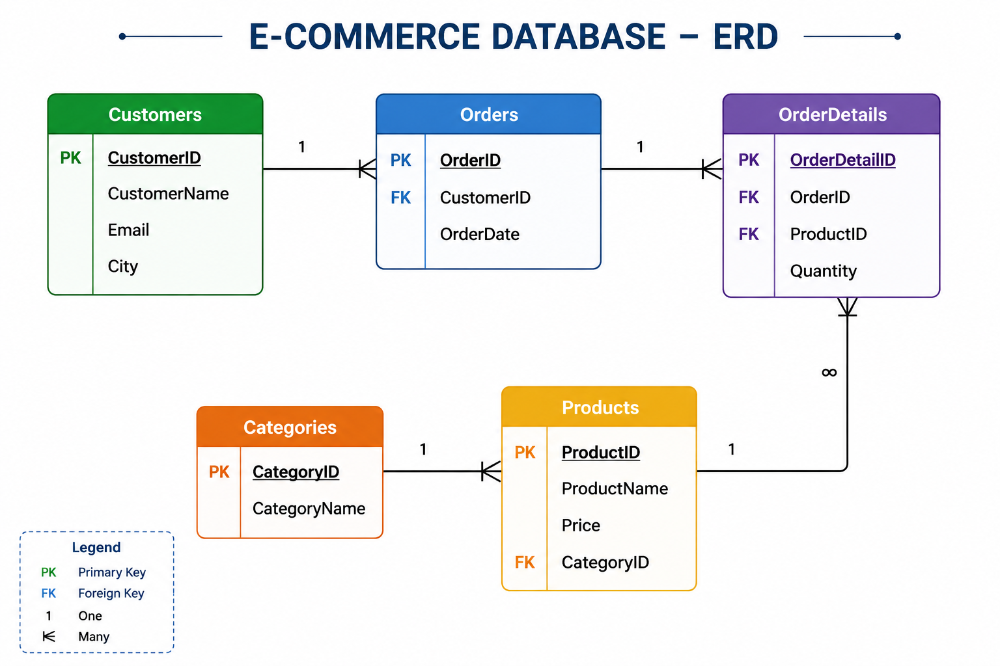

# 🛒 E-Commerce Database Management System

## 📌 Project Overview

This project simulates a complete E-Commerce Database Management System using SQL Server.

The database is designed to manage customers, products, categories, orders, and order details while demonstrating relational database design principles and business-oriented SQL queries.

The project showcases how transactional sales data can be organized and analyzed to support customer behavior analysis, sales reporting, and inventory-related insights.

---

## 📊 Entity Relationship Diagram (ERD)



---

## 🗄️ Database Structure

### Customers
Stores customer information including name, email, and city.

### Categories
Stores product categories.

### Products
Contains product details including pricing and category assignment.

### Orders
Stores customer purchase orders.

### OrderDetails
Acts as a bridge table between orders and products while storing purchased quantities.

---

## 🔗 Database Relationships

- One Customer can place many Orders.
- One Order can contain many Products.
- One Product can appear in many Orders.
- One Category can contain many Products.

---

## 📈 Business Questions Answered

### Customer Analysis

- Which customers placed orders?
- Which customers purchased specific products?
- Which customers generated the highest spending?

### Product Analysis

- What products are most frequently purchased?
- Which products generate the highest revenue?

### Sales Analysis

- Total amount spent per customer.
- Product quantity sold.
- Revenue generated per order.

### Category Analysis

- Which categories contain the most products?
- Which categories contribute most to sales?

---

## 🛠 SQL Concepts Used

- Primary Keys
- Foreign Keys
- Joins
- Aggregate Functions
- GROUP BY
- HAVING
- ORDER BY
- Filtering
- Calculated Columns

---

## 💡 Example Queries

### Customer Orders

```sql
SELECT C.CustomerName, O.OrderID
FROM Customers C
JOIN Orders O
ON C.CustomerID = O.CustomerID;
```

### Product Purchases

```sql
SELECT Customers.CustomerName,
       Products.ProductName
FROM Customers
JOIN Orders
ON Customers.CustomerID = Orders.CustomerID
JOIN OrderDetails
ON Orders.OrderID = OrderDetails.OrderID
JOIN Products
ON OrderDetails.ProductID = Products.ProductID;
```

### Total Customer Spending

```sql
SELECT C.CustomerName,
       P.Price,
       D.Quantity,
       Quantity * Price AS TotalPrice
FROM Customers C
JOIN Orders O ON C.CustomerID = O.CustomerID
JOIN OrderDetails D ON D.OrderID = O.OrderID
JOIN Products P ON P.ProductID = D.ProductID;
```

---

## 🚀 Skills Demonstrated

- Relational Database Design
- SQL Query Development
- Sales Analytics
- Customer Analytics
- Data Retrieval & Reporting
- Business-Oriented Data Analysis

---

## 👨‍💻 Author

Mohamed Magdy

Aspiring Data Analyst passionate about SQL, Power BI, Python, and Business Intelligence.
